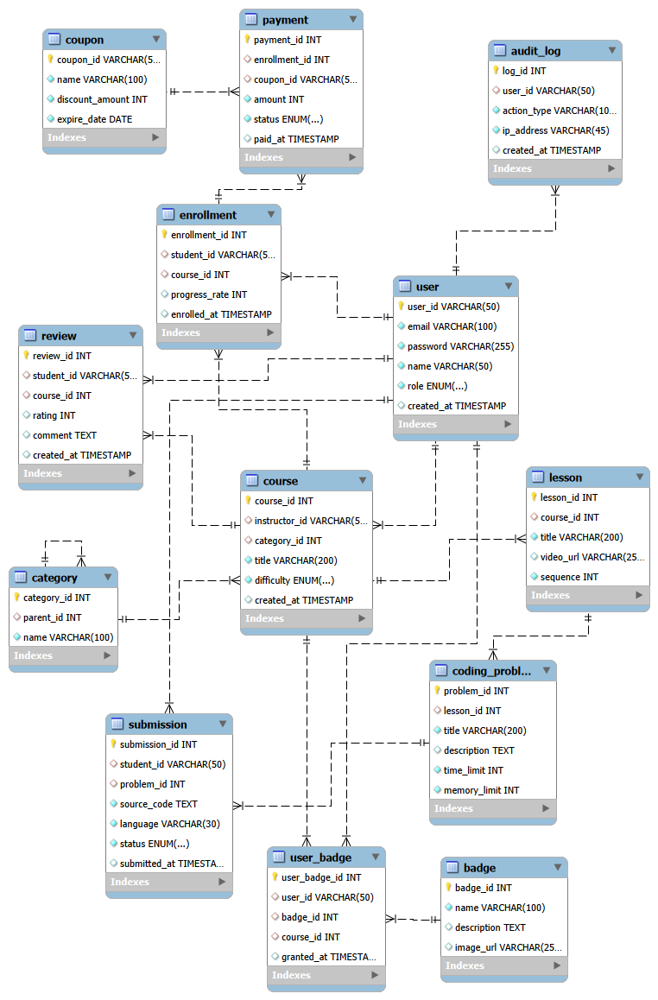
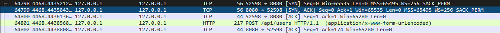
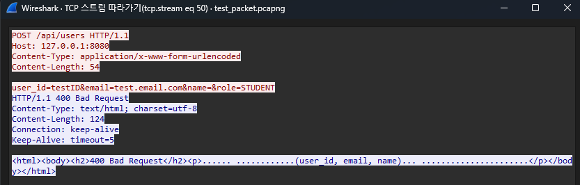
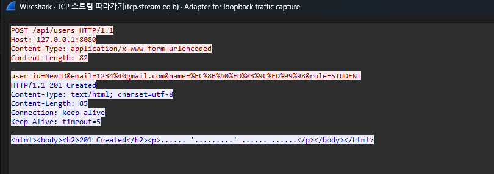

# 26_CN
# TCP 소켓 기반 HTTP 웹 서버 및 클라이언트 구현
**온라인 코딩 교육 및 저지(Judge) 플랫폼 백엔드 아키텍처 모사**

---

## 📋 목차
1. [프로젝트 개요](#1-프로젝트-개요)
2. [개발 환경 및 기술 스택](#2-개발-환경-및-기술-스택)
3. [시스템 아키텍처 및 데이터베이스 설계](#3-시스템-아키텍처-및-데이터베이스-설계)
4. [서버 사이드 코드 상세 분석](#4-서버-사이드-코드-상세-분석-serverpy)
5. [클라이언트 사이드 코드 상세 분석](#5-클라이언트-사이드-코드-상세-분석-clientpy)
6. [터미널 실행 결과 및 상태 코드 검증](#6-터미널-실행-결과-및-상태-코드-검증)
7. [Wireshark 패킷 캡처 및 네트워크 계층 검증](#7-wireshark-패킷-캡처-및-네트워크-계층-검증)
8. [결론 및 고찰](#8-결론-및-고찰)

---

## 1. 프로젝트 개요

### 1.1. 목적 및 배경
본 프로젝트는 저수준(Low-level) 파이썬 TCP 소켓을 활용하여 HTTP/1.1 프로토콜의 동작 원리를 구현한 클라이언트-서버 시스템입니다. 프레임워크(Django, Spring 등)에 의존하지 않고, 원시 바이트(Raw Byte) 단위의 통신부터 HTTP 메시지 파싱, 데이터베이스 트랜잭션 제어까지 웹 서버의 내부 동작을 직접 설계하고 검증하는 것을 목표로 합니다. 

### 1.2. 주요 구현 목표
* **HTTP 프로토콜 분석:** 소켓을 통해 수신된 바이트 데이터를 문자열로 디코딩하고, `\r\n`을 기준으로 HTTP 헤더와 본문(Body)을 분리하여 파싱.
* **네트워크 세션 관리:** HTTP/1.1의 Keep-Alive(지속 연결)를 구현하여 통신 오버헤드 최소화.
* **RESTful 아키텍처 적용:** GET, POST, PUT, DELETE 메서드에 따른 데이터베이스 CRUD 매핑.
* **무결성 및 예외 처리:** DB 제약 조건(UNIQUE) 충돌 시 롤백(Rollback) 처리 및 적절한 HTTP 상태 코드(409 Conflict 등) 반환.
* **데이터 인코딩 및 정제:** 클라이언트 전송 시 URL 인코딩 적용 및 수신 시 정규표현식을 활용한 HTML 태그 제거.

### 1.3. 프로젝트 시연 영상
본 프로젝트의 실제 구동 화면, 트러블슈팅, 그리고 Wireshark를 통한 패킷 검증 과정은 아래 유튜브 링크에서 확인하실 수 있습니다.
    YouTube 링크: [https://youtu.be/zS5tefzHgF0]

---

## 2. 개발 환경 및 기술 스택

* **Language:** Python 3.10+
* **Database:** MySQL 8.0 (PyMySQL 1.1.0)
* **Network/Protocol:** `socket` 모듈, HTTP/1.1, TCP/IP (Port 9090)
* **Standard Library:** `urllib.parse` (URL 인코딩/디코딩), `re` (정규표현식 파싱)
* **Tools:** VSCode, MySQL Workbench, Wireshark (패킷 캡처 및 분석)

---

## 3. 시스템 아키텍처 및 데이터베이스 설계 상세

본 시스템은 단순한 에코(Echo) 서버를 넘어, 실제 상용 수준의 온라인 코딩 교육 및 알고리즘 저지(Judge) 플랫폼을 모사하기 위해 총 12개의 테이블로 정규화된 `coding_platform` 데이터베이스를 설계 및 구축했습니다. 각 테이블은 참조 무결성(Referential Integrity)과 비즈니스 로직의 안정성을 보장하도록 엄격한 제약조건을 포함합니다.



### 3.1. 사용자 및 학습 도메인
1. **USER (사용자 테이블)**
   * `user_id`를 기본키(PK)로 사용하며, `role` 칼럼을 `ENUM('ADMIN', 'INSTRUCTOR', 'STUDENT')`으로 지정하여 애플리케이션 계층에서의 권한 기반 라우팅(Authorization)을 지원합니다.
   * `email` 칼럼에 `UNIQUE NOT NULL` 제약 조건을 설정하여, 중복 가입 트랜잭션 발생 시 데이터베이스 단에서 `IntegrityError`를 발생시키고 서버가 이를 캐치하여 `409 Conflict`로 응답하게 하는 핵심 기준점입니다.

2. **CATEGORY (카테고리 테이블)**
   * `parent_id`를 외래키(FK)로 가지는 인접 목록 모델(Adjacency List Model) 형태의 자기 참조(Self-Referencing) 구조입니다. 이를 통해 '개발 > 웹 개발 > 파이썬'과 같은 무한 뎁스의 트리(Tree)형 카테고리를 단일 테이블로 구현했습니다.

3. **COURSE & LESSON (강의 및 레슨 테이블)**
   * `COURSE`는 `instructor_id`를 FK로 가져 강사와 1:N 관계를 맺으며, 난이도를 `ENUM('BEGINNER', 'INTERMEDIATE', 'ADVANCED')`로 엄격히 통제합니다.
   * `LESSON`은 개별 영상 단위로, 부모인 `COURSE`가 삭제될 경우 고아 데이터(Orphan Data)가 남지 않도록 `ON DELETE CASCADE` 옵션을 적용했습니다.

4. **ENROLLMENT (수강신청 교차 테이블)**
   * 학생(USER)과 강의(COURSE) 간의 다대다(M:N) 관계를 데이터베이스에서 논리적으로 해소하기 위한 교차 엔티티입니다.
   * 핵심 제약조건으로 `UNIQUE(student_id, course_id)` 복합 유니크 키를 설정하여, 애플리케이션 단의 검증 로직 누락 시에도 동일 과목 중복 수강이 데이터베이스 레벨에서 원천 차단되도록 설계했습니다.

5. **REVIEW (수강평 테이블)**
   * `CHECK (rating BETWEEN 1 AND 5)` 제약 조건을 삽입하여, 평점 데이터가 1~5 사이의 정수만 적재되도록 무결성을 강제했습니다.

### 3.2. 알고리즘 저지(Judge) 코어 도메인
6. **CODING_PROBLEM (알고리즘 문제 테이블)**
   * 단순 게시판 구조를 탈피하여, 알고리즘 채점 시스템의 명세에 맞춰 `time_limit`(밀리초 단위 시간 제한)과 `memory_limit`(메가바이트 단위 메모리 제한) 칼럼을 명시적으로 설계했습니다.

7. **SUBMISSION (코드 제출 테이블)**
   * 제출된 원시 소스 코드(`source_code`)와 프로그래밍 언어(`language`)를 저장합니다.
   * `status` 칼럼은 `ENUM('SUCCESS', 'WRONG_ANSWER', 'TIME_LIMIT', 'MEMORY_LIMIT', 'COMPILE_ERROR')`으로 구성되어, 별도의 채점 워커(Worker) 프로세스가 동작한 후 상태를 비동기적으로 갱신할 수 있는 상용 저지 서버의 스키마를 모사했습니다.

### 3.3. 결제, 보상 및 보안 도메인
8. **BADGE & USER_BADGE (게이미피케이션 로직)**
   * 특정 코스 수료 시 지급되는 뱃지를 관리하며, `course_id`에 `ON DELETE SET NULL`을 적용하여 코스가 삭제되어도 유저가 획득한 뱃지 이력은 보존되도록 유연하게 설계했습니다.

9. **COUPON & PAYMENT (결제 트랜잭션)**
   * `PAYMENT` 테이블의 `status`를 `ENUM('PAID', 'CANCELLED', 'FAILED')`로 관리하여 멱등성을 보장하는 결제 트랜잭션 처리가 가능하도록 구성했습니다.

10. **AUDIT_LOG (감사 로그 테이블)**
    * 데이터베이스 내에서 발생하는 사용자의 주요 변경 액션과 IP 주소를 기록하여, 시스템 침해 사고 발생 시 역추적이 가능하도록 보안성을 강화했습니다.

---

## 4. 서버 사이드 코드 상세 분석 (`server.py`)

서버 코드는 파이썬 기본 `socket` 모듈을 이용하여 구현되었으며, 크게 소켓 초기화, HTTP 파싱, 라우팅, 트랜잭션 제어의 4단계로 구성됩니다.

### 4.1. 소켓 초기화 및 Keep-Alive 구현
```python
def run_server():
    server_socket = socket.socket(socket.AF_INET, socket.SOCK_STREAM)
    server_socket.setsockopt(socket.SOL_SOCKET, socket.SO_REUSEADDR, 1)
    server_socket.bind((HOST, PORT))
    server_socket.listen(5)
    print(f"[*] HTTP 서버 구동 완료 (포트 {PORT}) - HTTP/1.1 Keep-Alive 모드")

    while True: # 메인 루프 (새로운 클라이언트 접속 대기)
        client_socket, addr = server_socket.accept()
        client_socket.settimeout(5.0) # 5초간 요청 대기 (타임아웃 설정)
        
        try:
            while True: # 단일 TCP 연결 내 다중 요청 처리를 위한 내부 루프
                try:
                    request_data = client_socket.recv(4096).decode('utf-8')
                    if not request_data:
                        break
```
* **로직 분석:**
* `SO_REUSEADDR`: 서버 스크립트를 재시작할 때 포트가 `TIME_WAIT` 상태에 빠져 바인딩이 거부되는 현상(Address already in use)을 방지합니다.
* `listen(5)`: 최대 5개의 동시 접속 요청을 대기 큐(Backlog Queue)에 보관합니다.
* **이중 while 루프와 settimeout:** 매 통신마다 3-Way Handshake를 반복하는 HTTP/1.0의 한계를 극복하기 위한 핵심 로직입니다. 클라이언트가 접속하면 소켓 수명(Timeout)을 5초로 설정하고 서브 루프에 진입합니다. 5초 이내에 추가 요청이 들어오면 기존 TCP 파이프라인을 재사용하여 처리(Keep-Alive)하며, 타임아웃 발생 시에만 `except socket.timeout` 블록으로 빠져나가 소켓을 우아하게 종료합니다.


### 4.2. HTTP 패킷 수동 파싱 알고리즘

```python
# 1. 헤더와 본문 분리
parts = request_data.split('\r\n\r\n', 1)
header_section = parts[0]
body_section = parts[1] if len(parts) > 1 else ""

# 2. Request Line 파싱
lines = header_section.split('\r\n')
method, full_path, _ = lines[0].split(' ')

# 3. URL 및 Query String 분리
parsed_url = urllib.parse.urlparse(full_path)
path = parsed_url.path
query_params = urllib.parse.parse_qs(parsed_url.query)

# 4. Content-Length 식별
content_length = 0
for line in lines[1:]:
    if line.lower().startswith('content-length:'):
        content_length = int(line.split(':')[1].strip())
        break

```

* **로직 분석:**
* 수신된 바이트(Byte) 배열을 디코딩한 후, HTTP 메시지 구조의 규약인 이중 줄바꿈(`\r\n\r\n`)을 기준으로 헤더와 바디를 1차 분리합니다.
* 헤더의 첫 줄(Request Line)을 공백 기준으로 쪼개어 HTTP 메서드(GET, POST 등)와 경로(`/api/users` 등)를 추출합니다.
* `urllib.parse`를 활용해 GET 요청 시 동적으로 전달되는 쿼리 스트링(`?role=STUDENT`)을 딕셔너리 형태로 파싱합니다.
* 헤더를 순회하며 `Content-Length`를 찾아내어, HTTP 바디의 무결성을 검증하고 정확한 페이로드 사이즈를 측정하는 기준으로 삼습니다.


### 4.3. DB 트랜잭션 제어 (안전한 롤백 처리)

```python
if method == "POST":
    try:
        sql = "INSERT INTO USER (user_id, email, name, role) VALUES (%s, %s, %s, %s)"
        cursor.execute(sql, (body_params['user_id'], body_params['email'], body_params['name'], body_params['role']))
        db_conn.commit()
        response = build_response("201 Created", f"유저 '{body_params['name']}' 등록 완료")
    except pymysql.err.IntegrityError as e:
        db_conn.rollback()
        response = build_response("409 Conflict", "이미 존재하는 아이디이거나 사용 중인 이메일입니다.")

```

* **로직 분석:**
* 파이썬 DB-API인 `PyMySQL`을 사용하여 SQL 쿼리를 실행합니다. 포맷 스트링(f-string) 대신 `%s` 바인딩 변수를 사용하여 SQL 인젝션(SQL Injection) 공격을 원천 방어합니다.
* 데이터 삽입 중 이메일 또는 ID의 `UNIQUE` 제약 조건 충돌로 `IntegrityError`가 발생할 경우, 예외 처리 블록으로 이동하여 **반드시 `db_conn.rollback()`을 명시적으로 호출**합니다. 이를 통해 현재 세션의 트랜잭션 락(Lock)을 해제하고 데이터베이스의 오염을 방지하며, 클라이언트에게 상태 코드 `409 Conflict`를 안전하게 반환하여 서버 데드락을 방지합니다.


### 4.4. 애플리케이션 단 보안 검증 라우팅 (DELETE)

```python
elif method == "DELETE":
    if body_params['user_id'] == 'admin01':
        response = build_response("403 Forbidden", "시스템 최고 관리자(ADMIN)는 삭제할 수 없습니다.")
    else:
        sql = "DELETE FROM USER WHERE user_id = %s"
        cursor.execute(sql, (body_params['user_id'],))
        if cursor.rowcount > 0:
            db_conn.commit()
            response = build_response("200 OK", "계정이 안전하게 삭제되었습니다.")
        else:
            response = build_response("404 Not Found", "삭제할 대상을 찾을 수 없습니다.")

```

* **로직 분석:**
* DELETE 요청이 들어오면 데이터베이스로 쿼리를 무조건 전송하지 않습니다. Payload 내부의 `user_id`를 선제적으로 검증하여, 식별자가 `admin01`인 경우 DB 접근 이전에 애플리케이션 계층에서 `403 Forbidden`을 반환해 최고 권한 계정을 강제 보호합니다.
* 또한 `cursor.rowcount` 속성을 검사하여 실제 삭제된 row가 0개일 경우, `404 Not Found`를 반환해 멱등성(Idempotency)에 기반한 상태 코드를 정확히 응답합니다.

---

## 5. 클라이언트 사이드 코드 상세 분석 (`client.py`)

클라이언트 사이드 코드는 사용자가 터미널 환경에서 백엔드 서버와 직관적으로 소통할 수 있도록 CLI(Command Line Interface) 관리자 콘솔을 구현한 스크립트입니다.

### 5.1. 전송 계층 페이로드(Payload) URL 인코딩
```python
# 사용자 입력 (CLI 환경)
uid = input(" * 아이디(user_id): ").strip()
email = input(" * 이메일(email): ").strip()
name = input(" * 이름(name): ").strip()

# 한글 및 특수문자 전송을 위한 URL 인코딩(Percent-encoding) 적용
body = f"user_id={urllib.parse.quote(uid)}&email={urllib.parse.quote(email)}&name={urllib.parse.quote(name)}"
send_request("POST", "/api/users", body)

```

* **로직 분석:**
* HTTP 규약 상 본문(Body) 데이터에 영문 알파벳(ASCII)이 아닌 한글 이름(`신태환`)이나 이메일의 골뱅이(`@`) 등 특수문자가 날것(Raw)으로 실릴 경우, 네트워크 전송 중 바이트 손상(인코딩 깨짐)이 발생합니다.
* 이를 방어하기 위해 `application/x-www-form-urlencoded` 전송 규격에 맞춰 파이썬 내장 함수인 `urllib.parse.quote()`를 일괄 적용했습니다. 이를 통해 한글 데이터가 네트워크 소켓을 탈 때 `%EC%8B%A0` 과 같은 안전한 Percent-encoding 텍스트 포맷으로 변환되어 송신 무결성을 확보합니다.


### 5.2. 정규표현식을 활용한 수신 데이터 렌더링

```python
# 서버에서 수신한 원시 바이트 패킷 디코딩 및 분할
parts = response.split('\r\n\r\n', 1)
headers = parts[0]
resp_body = parts[1] if len(parts) > 1 else ""

# 상태 코드 라인 추출
status_line = headers.split('\r\n')[0]

# 정규표현식을 통한 HTML 태그 클렌징(Cleansing)
clean_body = resp_body.replace('<br>', '\n').replace('</p>', '\n')
clean_body = re.sub(r'<[^>]+>', '', clean_body).strip()

print(f"✅ [서버 응답 상태] {status_line}")
print(f"📄 [서버 응답 본문]\n{clean_body}")

```

* **로직 분석:**
* 서버에서 반환된 HTTP 메시지를 헤더(`headers`)와 바디(`resp_body`)로 분할합니다.
* 백엔드 서버가 브라우저 환경을 고려하여 응답 본문을 `<html><body>` 태그로 래핑하여 전송하면, CLI 환경에서는 가독성이 심각하게 저하됩니다.
* 파이썬의 정규표현식 모듈인 `re`를 도입하여, 패턴 `<[^>]+>`를 적용했습니다. 이는 `<` 문자로 시작하고 `>` 문자로 끝나는 모든 문자(HTML 태그)를 매칭하여 공백(`''`)으로 치환하는 강력한 클렌징 로직입니다.
* 줄바꿈을 의미하는 `<br>`과 `</p>` 태그는 선제적으로 개행 문자(`\n`)로 치환하여, 터미널(Console) 환경에 최적화된 깔끔하고 정돈된 텍스트 뷰를 제공합니다.

---

## 6. 터미널 실행 결과 및 상태 코드 검증

구현된 서버와 클라이언트를 구동하여 REST API의 다양한 상태 코드 반환을 검증한 로그입니다.

### 6.1. 400 Bad Request (필수 파라미터 누락)
클라이언트에서 가입 시 이름 파라미터를 누락하고 요청을 보낸 결과입니다.

```text
#######################################################
    [ 코딩 교육 플랫폼 관리자 콘솔 v1.1 ]
#######################################################
 1. 신규 회원(수강생/강사) 가입 처리
 2. 전체 회원 리스트 조회
 3. 권한별(Role) 회원 검색
 4. 회원 정보(이름/권한) 수정
 5. 회원 강제 탈퇴 처리
 6. 잘못된 시스템 경로 접근 테스트
 0. 관리자 콘솔 종료
-------------------------------------------------------
원하시는 작업 번호를 입력하세요: 1

>>> [ 신규 회원 가입 ] 빈칸으로 두면 에러 테스트가 가능합니다.
 * 아이디(user_id): testID
 * 이메일(email): test.email.com
 * 이름(name): 
 * 권한(STUDENT/INSTRUCTOR/ADMIN) [기본값:STUDENT]:  

============================================================
📡 [서버로 요청 전송] POST /api/users
📦 [전송 데이터] user_id=testID&email=test.email.com&name=&role=STUDENT
------------------------------------------------------------
✅ [서버 응답 상태] HTTP/1.1 400 Bad Request
📄 [서버 응답 본문]
400 Bad Request필수 파라미터(user_id, email, name)가 누락되었습니다.
============================================================
```

### 6.2. 201 Created & 409 Conflict (정상 생성 및 무결성 충돌 방어)
정상적인 데이터 삽입 후, 동일한 데이터를 재전송하여 DB 롤백 처리를 유도한 결과입니다.

```text
#######################################################
    [ 코딩 교육 플랫폼 관리자 콘솔 v1.1 ]
#######################################################
 1. 신규 회원(수강생/강사) 가입 처리
 2. 전체 회원 리스트 조회
 3. 권한별(Role) 회원 검색
 4. 회원 정보(이름/권한) 수정
 5. 회원 강제 탈퇴 처리
 6. 잘못된 시스템 경로 접근 테스트
 0. 관리자 콘솔 종료
-------------------------------------------------------
원하시는 작업 번호를 입력하세요: 1

>>> [ 신규 회원 가입 ] 빈칸으로 두면 에러 테스트가 가능합니다.
 * 아이디(user_id): testID
 * 이메일(email): test.email.com
 * 이름(name): testName
 * 권한(STUDENT/INSTRUCTOR/ADMIN) [기본값:STUDENT]: 

============================================================
📡 [서버로 요청 전송] POST /api/users
📦 [전송 데이터] user_id=testID&email=test.email.com&name=testName&role=STUDENT
------------------------------------------------------------
✅ [서버 응답 상태] HTTP/1.1 201 Created
📄 [서버 응답 본문]
201 Created유저 'testName' 등록 완료
============================================================

#######################################################
    [ 코딩 교육 플랫폼 관리자 콘솔 v1.1 ]
#######################################################
 1. 신규 회원(수강생/강사) 가입 처리
 2. 전체 회원 리스트 조회
 3. 권한별(Role) 회원 검색
 4. 회원 정보(이름/권한) 수정
 5. 회원 강제 탈퇴 처리
 6. 잘못된 시스템 경로 접근 테스트
 0. 관리자 콘솔 종료
-------------------------------------------------------
원하시는 작업 번호를 입력하세요: 1

>>> [ 신규 회원 가입 ] 빈칸으로 두면 에러 테스트가 가능합니다.
 * 아이디(user_id): testID
 * 이메일(email): test.email.com
 * 이름(name): testName
 * 권한(STUDENT/INSTRUCTOR/ADMIN) [기본값:STUDENT]: 

============================================================
📡 [서버로 요청 전송] POST /api/users
📦 [전송 데이터] user_id=testID&email=test.email.com&name=testName&role=STUDENT
------------------------------------------------------------
✅ [서버 응답 상태] HTTP/1.1 409 Conflict
📄 [서버 응답 본문]
409 Conflict이미 존재하는 아이디이거나 사용 중인 이메일입니다.
DB 에러: Duplicate entry 'testID' for key 'user.PRIMARY'
============================================================
```

### 6.3. 200 OK (GET 동적 쿼리 및 데이터 정제 포맷팅 출력)
권한 필터링(`?role=STUDENT`)을 적용한 GET 조회 결과이며, HTML이 완벽히 제거되어 콘솔에 예쁘게 정렬된 모습입니다.

```text
#######################################################
    [ 코딩 교육 플랫폼 관리자 콘솔 v1.1 ]
#######################################################
 1. 신규 회원(수강생/강사) 가입 처리
 2. 전체 회원 리스트 조회
 3. 권한별(Role) 회원 검색
 4. 회원 정보(이름/권한) 수정
 5. 회원 강제 탈퇴 처리
 6. 잘못된 시스템 경로 접근 테스트
 0. 관리자 콘솔 종료
-------------------------------------------------------
원하시는 작업 번호를 입력하세요: 3

>>> [ 권한별 회원 검색 ]
 * 검색할 권한(예: INSTRUCTOR): STUDENT

============================================================
📡 [서버로 요청 전송] GET /api/users?role=STUDENT
------------------------------------------------------------
✅ [서버 응답 상태] HTTP/1.1 200 OK
📄 [서버 응답 본문]
200 OK총 11명의 회원이 조회되었습니다.
-------------------------------------------------------
 1. [STUDENT   ] 이학생 (stud01) |  stud1@test.com
 2. [STUDENT   ] 박학생 (stud02) |  stud2@test.com
 3. [STUDENT   ] 신태환 (stud03) |  stud03@test.com
 4. [STUDENT   ] 유학생 (stud04) |  stud4@test.com
 5. [STUDENT   ] 조학생 (stud05) |  stud5@test.com
 6. [STUDENT   ] 강학생 (stud06) |  stud6@test.com
 7. [STUDENT   ] 윤학생 (stud07) |  stud7@test.com
 8. [STUDENT   ] 장학생 (stud08) |  stud8@test.com
 9. [STUDENT   ] 임학생 (stud09) |  stud9@test.com
10. [STUDENT   ] 한학생 (stud10) |  stud10@test.com
11. [STUDENT   ] testName (testID) |  test.email.com
-------------------------------------------------------
============================================================
```

### 6.4. 403 Forbidden & 404 Not Found (권한 부족 및 데이터 부재)
관리자 계정 삭제 시도 시 애플리케이션 단에서 차단되는 결과와, 없는 유저를 수정 시도한 결과입니다.

```text
#######################################################
    [ 코딩 교육 플랫폼 관리자 콘솔 v1.1 ]
#######################################################
 1. 신규 회원(수강생/강사) 가입 처리
 2. 전체 회원 리스트 조회
 3. 권한별(Role) 회원 검색
 4. 회원 정보(이름/권한) 수정
 5. 회원 강제 탈퇴 처리
 6. 잘못된 시스템 경로 접근 테스트
 0. 관리자 콘솔 종료
-------------------------------------------------------
원하시는 작업 번호를 입력하세요: 5

>>> [ 회원 강제 탈퇴 ]
 * 탈퇴시킬 회원의 아이디: admin01

============================================================
📡 [서버로 요청 전송] DELETE /api/users
📦 [전송 데이터] user_id=admin01
------------------------------------------------------------
✅ [서버 응답 상태] HTTP/1.1 403 Forbidden
📄 [서버 응답 본문]
403 Forbidden시스템 최고 관리자(ADMIN)는 삭제할 수 없습니다.
============================================================

#######################################################
    [ 코딩 교육 플랫폼 관리자 콘솔 v1.1 ]
#######################################################
 1. 신규 회원(수강생/강사) 가입 처리
 2. 전체 회원 리스트 조회
 3. 권한별(Role) 회원 검색
 4. 회원 정보(이름/권한) 수정
 5. 회원 강제 탈퇴 처리
 6. 잘못된 시스템 경로 접근 테스트
 0. 관리자 콘솔 종료
-------------------------------------------------------
원하시는 작업 번호를 입력하세요: 4

>>> [ 회원 정보 수정 ]
 * 수정할 회원의 아이디: ghostID
 * 새로운 이름 (변경 안함 = 엔터): llll
 * 새로운 권한 (변경 안함 = 엔터):   

============================================================
📡 [서버로 요청 전송] PUT /api/users
📦 [전송 데이터] user_id=ghostID&name=llll
------------------------------------------------------------
✅ [서버 응답 상태] HTTP/1.1 404 Not Found
📄 [서버 응답 본문]
404 Not Found수정하려는 대상('ghostID')이 존재하지 않거나 변경 내용이 없습니다.
============================================================
```

---

## 7. Wireshark 패킷 캡처 및 네트워크 계층 검증

단순히 터미널에 텍스트가 뜨는 것을 넘어, 실제 네트워크 소켓에서 데이터가 규약에 맞게 전송되었는지 로컬호스트(루프백) 포트 9090을 캡처하여 검증했습니다.

### 7.1. TCP 3-Way Handshake 및 연결 해제 (Teardown)

* HTTP 통신 발생 직전, 클라이언트 포트와 서버 포트(9090) 간에 `SYN` ➔ `SYN, ACK` ➔ `ACK` 패킷이 교환되며 신뢰성 있는 TCP 연결이 성립됨을 확인했습니다.
* 시연 종료 후 5초의 타임아웃이 경과하자 서버 측에서 `FIN` 패킷을 전송하여 연결을 안전하게 회수(Graceful Shutdown)하는 것을 확인했습니다.

### 7.2. HTTP/1.1 Keep-Alive (다중 요청 스트림)

* 패킷의 [Follow TCP Stream]을 확인한 결과, 응답 헤더에 `Connection: keep-alive`가 명확히 기재되어 있습니다.

### 7.3. Payload URL 인코딩 및 Content-Length 일치 여부

*(위 경로에 바디 데이터 인코딩 캡처 이미지를 삽입하세요)*
* 클라이언트에서 전송한 한글 이름 `신태환`과 이메일의 특수문자 `@`가 원문이 아닌 `%EC%8B%A0%ED%83%9C%ED%99%98` 및 `%40`으로 변환되어 바이트 스트림에 실린 것을 확인했습니다.
* 헤더의 `Content-Length` 값과 실제 전송된 바이트 길이가 정확히 일치하여, 패킷 조각화 과정에서 발생할 수 있는 데이터 손실이 없음을 증명했습니다.

---

## 8. 결론 및 고찰

본 프로젝트를 통해 추상화된 웹 프레임워크 아래에서 네트워크 트래픽이 실제로 어떻게 교환되고 제어되는지 심도 있게 이해할 수 있었습니다. 

특히 HTTP/1.0의 단기 연결 방식을 HTTP/1.1의 Keep-Alive 로직으로 업그레이드하면서 소켓의 타임아웃과 블로킹 개념을 명확히 익혔으며, 데이터베이스 트랜잭션 도중 발생하는 무결성 예외를 `try-except`와 `rollback()`을 통해 직접 방어함으로써 백엔드 서버의 안정성이 구성되는 핵심 원리를 습득했습니다.
